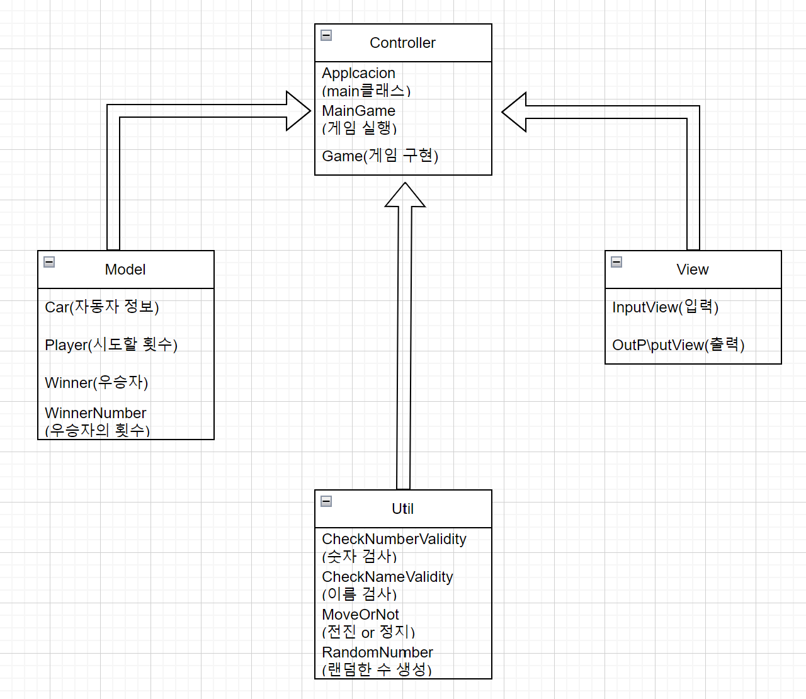

# java-racingcar-precourse

-----

# 자동차 경주

1. 경주할 자동차들의 이름을 입력한다. 올바르지 않은 이름이 있다면 다시 입력받는다.
2. 시도할 횟수를 n을 입력 받는다. 1이상의 정수가 아니거나 너무 큰수면 다시 입력받는다.
3. 각 자동차별로 0 ~ 9까지의 랜덤한 수를 생성하여 4 ~ 9까지라면 전진 0 ~ 3까지라면 정지를 한다.
4. 3번을 n번 만큼 반복한다.
5. 끝난 후 우승한 자동차를 발표한다.

-----

# 구현기능 목록

유저로 부터 자동차 이름 입력
- 문자열로 입력 받은 자동차 이름을 ","로 구분한다.
- 구분된 자동차 이름이 올바른지 검사한다.
- 자동차 이름을 토대로 Car 객체를 생성한다.

유저로 부터 시도할 횟수를 입력
- 시도할 횟수를 입력 받고 올바른 값인지 검사한다.

랜덤한 수 생성
- 0 ~ 9 사이의 무작위 정수 1가지를 생성한다.
- 0 ~ 3이면 정지, 4 ~ 9 면 전진 한다.

MVC모델

Controller
- Application: 게임실행 main 클래스
- MainGame: Game클래스의 totalGame메소드 실행
- Game: 실질적인 게임을 구성하는 클래스

Model
- Car: 자동차의 정보를 저장하는 클래스로 이름, 현재의 상태, 전진 횟수를 가짐
- Player: 플레이어가 입력한 시도할 횟수를 저장
- Winner: 게임 종료후 가장 많이 이동한 우승자를 저장
- WinnerNumber: 우승자의 전진 횟수를 저장

View
- InputView: 입력에 관한 메소드
- OutputView: 출력에 관한 메소드

Util
- MoveOrNot: 4 ~ 9사이면 전진하여 Car 클래스의 전진상태 및 전진 횟수를 변경
- CheckNumberValidity: 입력받은 횟수가 자연수인지, 큰수인지 유효성 판단
- CheckNameValidity: 자동차의 이름 유효성 검사하는 클래스(이름이 5자 이하, 영어로만 구성)
- MakeRandomNumber: 랜덤한 0 ~ 9사이의 정수 생성하는 클래스

- 