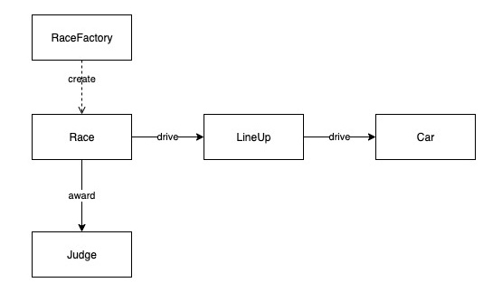

# 자동차 경주 게임
###1. 도메인 모델 

###2. 도메인 모델 별 기능목록
> ###RaceFactory 객체
> 1. 사용자에게 자동차 이름 리스트를 입력받는다.
>   * 입력포맷: "car1, car2, car3"
> 2. 잘못된 자동차 이름이 입력된 경우 에러 메시지를 출력한다.
>   * 잘못된 입력
>       * 빈 문자열이 입력된 경우
>       * 자동차 이름이 빈 문자열인 경우
>       * 자동차 이름의 길이가 6이상인 경우
> 3. 사용자에게 시도 횟수를 입력받는다.
>   * 입력포맷: "5"
> 4. 잘못된 시도 횟수가 입력된 경우 에러 메시지를 출력한다.
>   * 잘못된 입력
>       * 빈 문자열이 입력된 경우
>       * 문자가 입력된 경우
>       * 0이하의 숫자가 입력된 경우
> 5. 입력된 자동차 이름, 시도횟수로 Race 객체를 생성한다.

> ###Race 객체
> 1. 시도횟수만큼 LineUp 객체에게 "drive" 메시지를 전달한다.
> 2. Judge 객체에게 "award" 메시지를 전달한다.

> ###LineUp 객체
> ####Car 리스트를 가지는 일급 콜렉션 객체
> 1. Car 리스트에 있는 모든 Car 객체로 "drive" 메시지를 전달한다.
> 2. 경주 결과를 담는 Record 객체를 생성한다.

> ###Car 객체
> 1. 0 ~ 9 사이의 랜덤숫자를 생성한다.
> 2. 생성된 숫자가 4이상인 경우 전진 회수를 1을 더한다.

> ###Record 객체
> 1. 가장 많이 전진한 Car가 두개 이상인 경우 쉼표 이름을 구분해서 출력한다
