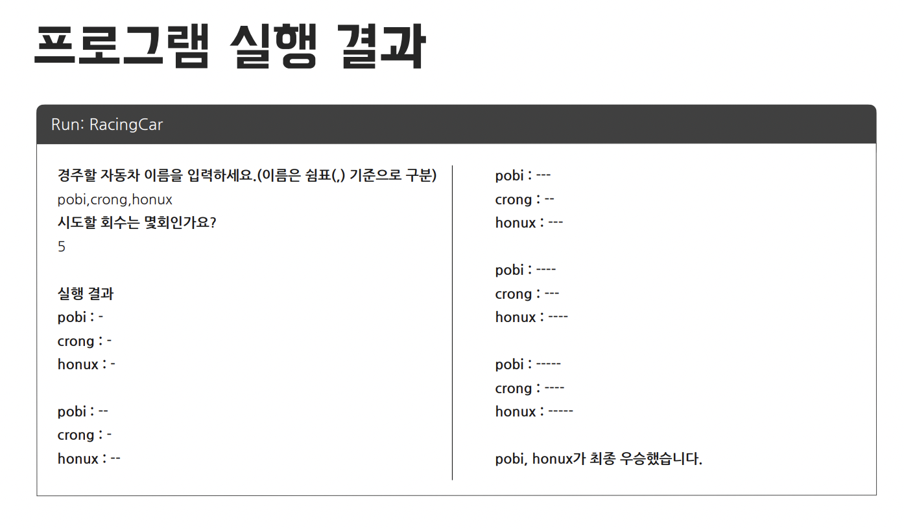

# 자동차 경주 게임
## 진행 방법
* 자동차 경주 게임 요구사항을 파악한다.
* 요구사항에 대한 구현을 완료한 후 자신의 github 아이디에 해당하는 브랜치에 Pull Request(이하 PR)를 통해 과제를 제출한다.

## 과제 제출 과정
* [과제 제출 방법](https://github.com/next-step/nextstep-docs/tree/master/precourse)

## 기능 요구사항
- 주어진 횟수 동안 n대의 자동차는 전진 또는 멈출수있다.
- 각 자동차에 이름을 부여할 수 있다. 전진하는 자동차를 출력할때 자동차 이름을 같이 출력한다.
- 자동차 이름은 쉼표(,)를 기준으로 구분하며 이름은 5자이하만 가능하다.
- 사용자는 몇번의 이동을 할 것 인지를 입력할 수 있어야 한다.
- 전진하는 조건은 0 에서 9 사이에서 random 값을 구한 후 random 값이 4 이상 일 경우 전진하고, 3 이하의 값이면 멈춘다.
- 자동차 경주 게임을 완료한 후 누가 우승했는지를 알려준다. 우승자는 한명 이상일 수있다.

## 프로그램 진행 샘플

## 기능 구현 목록

- 1 ~ 9 까지 랜덤한 수 생성 기능
- 한칸 전진하는 기능이 있는 자동차와 일급 컬렉션 구현
- 입력이 4 이상일 경우 이동하고 아닐 경우 이동하지 않는 기능 구현
- 차들의 이름을 , 로 구분하여 입력받고 그 수만큼 생성하는 기능 및 5자 초과인 경우 예외처리
- 횟수를 입력받아 모든 차들에게 횟수만큼 이동명령을 주는기능 구현
- 각 이동턴 마다 결과가 출력될 수 있도록 변경
- 최종 우승자를 구하는 기능
