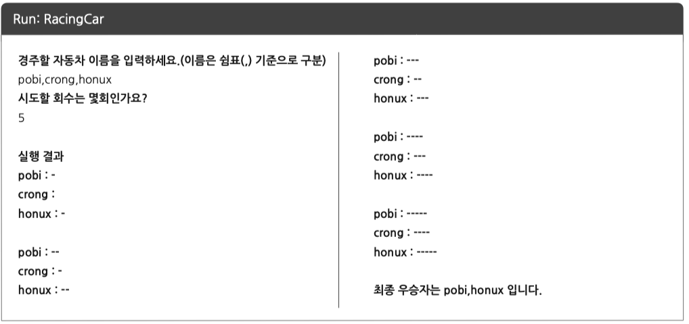

# 자동차 경주 게임

## 1. 기능 구현

- Car: 자동차
  - 문자열 이름을 가지고 있다.
  - 위치를 가지고 있다.
    - 몇번 움직였느냐에 대한 데이터
- Cars: 자동차 일급 컬렉션
  - 게임 참여자들을 관리한다. 
- GameRule: 자동차 전진 규칙
  - 4이상의 값이면 전진한다.
  - 3이하의 값이면 멈춘다.
- NumberGenerator: 숫자 생성기
  - 0 ~ 9 사이의 랜덤한 값을 생성한다.
- Round: 게임을 진행할 횟수
  - 숫자 생성기를 통해 숫자를 생성한다.
  - 각각 자동차들은 생성된 숫자와 규칙에 따라 자동차의 위치를 증가하여 반환한다.
  - 최종적으로 자동차 일급 컬렉션을 반환한다.
- Winner: 우승한 자동차를 관리할 일급 컬렉션
  - 자동차 일급 컬렉션을 관리한다.
  - 자동차들의 위치를 비교하여 우승자를 반환한다.
  
## 2. 기능 요구사항

- 주어진 횟수 동안 n대의 자동차는 전진 또는 멈출 수 있다.
- 각 자동차에 이름을 부여할 수 있다. 전진하는 자동차를 출력할 때 자동차 이름을 같이 출력한다.
- 자동차 이름은 쉼표(,)를 기준으로 구분하며 이름은 5자 이하만 가능하다.
- 사용자는 몇번의 이동을 할것인지를 입력할 수 있어야 한다.
- 전진하는 조건은 0에서 9사이에서 `random`값을 구한후 random값이 4이상일 경우 전진하고, 3이하의 값이면 멈춘다.
- 자동차 경주 게임을 완료한 후 누가 우승했는지를 알려준다.
- 우승자가 한명 이상일 경우, 쉼표(,)로 이름을 구분해 출력한다.
- 사용자가 잘못된 값을 입력할 경우 “[ERROR]”로 시작하는 에러 메시지를 출력 후 입력을 다시 받는다.

### 2.1. 프로그램 결과

## 3. 프로그래밍 요구사항

- [일급 콜렉션을 활용해 구현한다.](https://developerfarm.wordpress.com/2012/02/01/object_calisthenics_/)
- [모든 원시값과 문자열을 포장한다.](https://developerfarm.wordpress.com/2012/01/27/object_calisthenics_4)
- 1주차 미션과 동일
  - 자동차 경주 게임을 실행하는 시작점은 `src/main/java` 폴더의 `baseball.Application`의 main()이다.
  - 자동차 경주 게임은 `JDK 8`버전에서 실행 가능해야 한다. JDK 8에서 정상 동작하지 않을 경우 0점 처리한다.
  - JDK에서 기본 제공하는 `Random`, `ScannerAPI`대신 `nextstep.utils` 패키지에서 제공하는 `Randoms`, `ConsoleAPI`를 활용해 구현해야 한다.
      - `Random` 값 추출은 `nextstep.utils.Randoms`의 `pickNumberInRange()`를 활용한다.
      - 사용자가 입력하는 값은 `nextstep.utils.Console`의 `readLine()`을 활용한다.
  - 프로그램 구현을 완료했을 때 `src/test/java`폴더의 `baseball.ApplicationTest`에 있는 2개의 `TestCase`가 성공해야 한다.
      - ApplicationTest에서 제공하는 2개의 TestCase는 자동차 경주 게임 구현을 위한 최소한의 TestCase이다.
      - 필수 요구사항은 아니지만 제공하는 소스코드를 참고해 자동차 경주 게임을 위한 모든 TestCase를 추가해 보는 것도 테스트에 대한 좋은 연습이 될 수 있다.
  - 자바 코드 컨벤션을 지키면서 프로그래밍한다.
      - [https://naver.github.io/hackday-conventions-java/](https://naver.github.io/hackday-conventions-java/)
  - indent(인덴트, 들여쓰기) depth를 2가 넘지 않도록 구현한다. 1까지만허용한다.
      - 예를 들어 while문 안에 if문이 있으면 들여쓰기는 2이다.
      - 힌트: indent(인덴트, 들여쓰기) depth를 줄이는 좋은 방법은 함수(또는메소드)를 분리하면 된다.
  - 자바 8에 추가된 `stream.api`를 사용하지 않고 구현해야 한다. 단, 람다는 사용 가능하다.
  - else 예약어를 쓰지 않는다.
      - 힌트: if 조건절에서 값을 return하는 방식으로 구현하면 else를 사용하지 않아도 된다.
      - else를 쓰지 말라고 하니 `switch/case`로 구현하는 경우가 있는데 `switch/case`도 허용하지 않는다.
  - 함수(또는메소드)의 길이가 10라인을 넘어가지 않도록 구현한다.
      - 함수(또는메소드)가 한 가지 일만 잘 하도록 구현한다.
