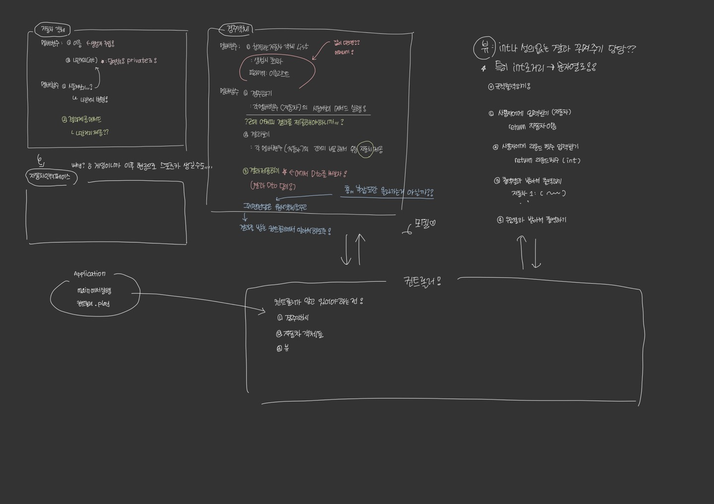

# 카테캠 1단계 2번째 미니과제 - 자동차 경주 (BE)

```
역시 아자아자!
```

## 기능 요구 사항

`⭐초초초초간단!자동차!경주!게임을!구현한다`

- 주어진 횟수 동안 n대의 자동차는 전진 또는 멈출 수 있다.
- 각 자동차에 이름을 부여할 수 있다. 전진하는 자동차를 출력할 때 자동차 이름을 같이 출력한다.
- 자동차 이름은 쉼표(,)를 기준으로 구분하며 이름은 5자 이하만 가능하다.
- 사용자는 몇 번의 이동을 할 것인지를 입력할 수 있어야 한다.
- 전진하는 조건은 0에서 9 사이에서 무작위 값을 구한 후 무작위 값이 4 이상일 경우이다.
- 자동차 경주 게임을 완료한 후 누가 우승했는지를 알려준다. 우승자는 한 명 이상일 수 있다.
- 우승자가 여러 명일 경우 쉼표(,)를 이용하여 구분한다.
- 사용자가 잘못된 값을 입력할 경우 `IllegalArgumentException`를 발생시키고, "[ERROR]"로 시작하는 에러 메시지를 출력 후 그 부분부터 입력을 다
  시 받는다.
    - `Exception`이 아닌 , `IllegalArgumentException`, `IllegalStateException`등과 같은 명확한 유형을 처리한다.

## 예시 실행결과

```
경주할 자동차 이름을 입력하세요.(이름은 쉼표(,) 기준으로 구분) 
pobi,woni,jun 

시도할 회수는 몇회인가요? 
5


실행 결과 
pobi : - woni : jun : -
pobi : -- woni : - jun : --
pobi : --- woni : -- jun : ---
pobi : ---- woni : --- jun : ----
pobi : ----- woni : ---- jun : -----

최종 우승자 : pobi, jun
```

## 프로그래밍 요구 사항

    음,, 뭐가 많다. 정리가 목적이니까 내가 대충 정리하겠음

- JDK 17로 하자
- 별 다른거 건들지 말자
- 코드 컨벤션을 지키자. 들여쓰기는 4로 (난 2가 좋은디)
- depth는 3을 넘지 않도록 한다.
- 함수는 한 가지 일만 하도록!!
- 삼항 연산자 쓰지 않기
- JUnit 5와 AssertJ을 이용해서 테스트 하기
- 함수가 15줄을 넘어가지 않도록! (오 이건 진짜 특이하다..?)
- else 예약어 쓰지 않고 if문의 return 이용해서 풀어보기
- 도메인 로직에서 단위 테스트 구현하기, UI는 하지 않아도 되고 MVC에서 M에 대한 테스트만 진행

## MVC 패턴이 뭔데..!! ps.나는 그걸 몰라.

이걸 몰라도 스프링프레임워크를 활용해 개발을 해본 적 있다면, `컨트롤러 - 서비스 - 리파지토리` 구조를 알 고 있을 것이다.
이 구조도 MVC의 일종이라고 볼 수 있다. 🤔 더 자세히 알아보자 (다른 파일에 작성하면 더 좋을 것 같긴한데..!)

### MVC 패턴 알아보기

**코드를 더 유연하게 만들고 유지보수와 확장을 쉽게 하기 위해** 고안한 디자인 패턴이다.
즉 다시 말해, 유지보수 하기 어려운, 객체 지향 설계를 따르지 않는 불상가 일어나지 않도록 하는!! 방법!

그렇다면 🤔 유지보수 어려운 코드는 무엇인가..?
내가 생각했을 때는 마치 `도미노` 같은 코드다!
하나를 수정하면 여기저기여기저기 다~~~ 건드려야하는 코드, 도대체 시작과 끝이 어딘지 모르겠는 코드..!!

이 mvc패턴을 사용하면 수정에 유현하고, 시작과 끝(=역할)을 명확히 할 수 있다.

**Model**

- 비즈니스 로직을 처리하는 곳
- 컨트롤러와 소통한다.

**View**

- 사용자에게 결과를 전달하는 끝단, 사용자 인터페이스(**UI**)를 제공한다.
- 뷰에게 전달받는다!

**Controller**

- 모델과 뷰 사이의 흐름을 제어한다.
- 비즈니스 로직을 처리하지 않는다.

이렇게 설계된 구조를 MVC 패턴이라고 한다. (근데 왜 굳이.. MVC일까? VCM이 더 나은거 아님?)
뷰가 수정되더라도, 모델까지 영향을 주지 않고 반대의 경우도 그렇다.
또한 계층을 분리하여 책임이 명확해지고 가독성이 좋아지며 유지보수가 쉬워진다.

### MVC 패턴과 컨트롤러-서비스-레파지토리 비교해보기

`🤔 그런데 우리는 컨트롤러-서비스-레파지토리... 이것도 3계층인데? 이건 뭐임?`

허허 바로 말하자면 모델 부분을 더 세분화해서 서비스와 레파지토리로 분리한 것이다.
서비스는 비즈니스 규칙, 데이터 유효성 검사 등을 처리하고, 레파지토리는 데이터 베이스 접근을 담당한다.

따라서 위 3계층에는 V는 없고 CM만 있는 것!

뷰는 사용자에게 정보를 주는 방식에 따라 다른데, 최근에는 REST API를 통한 JSON응답으로 보통 구현한다.
이 부분이 뷰에 해당한다. 혹은 전통적으로 JSP도 있긴하다.

> 이야기가 너무 길어진듯하다.. 다시 과제주제로 돌아와서 우리는 MVC를 구현할 거고, 이중 M에 대한 테이스트만 진행할 것이다. 그러면 내가 직접 설계를 해보겠다잉~!

## 내가 다시 정의하는 기능 요구 사항



## 사용자에게는 (view)

0. 규칙을 설명해준다.
1. 자동차의 이름들을 입력받는다. 입력값 반환(문자열로)
2. 플레이할 라운드 횟수를 입력받는다. 입력값 반환(문자열로)
3. 자동차 정보와, 라운드 결과 전달 받고 "잘 꾸며서" 출력하기
4. 우승 결과를 받아서 출력하기

> #### 입력 값이 올바른지는 어디서 판단해야 하나? @_@
> 개발자의 판단에 맡기면 되겠지만... 일단 이 과제의 규칙 중 하나가, _모델에 대한 테스트만_ 하는 것이었다.
> 그래서 모델 외에는 로직을 추가할 수가 없다. 그러면 제대로 된 테스트가 아니게 되니까!!
>
> 나는 모델에서 검사를 하지만 다른 경우도 물론 있다. 진짜 간단히 예를 들어서 웹사이트에서 이메일 적을 때 @안쓰면 안 넘어가는 경우...
>
> 그러니까 각자의 상황이나 판단에 맡기면 될 듯!!

> #### 왜 문자열로 반환하도록 했냐면..!
> 이것도 위의 이유랑 비슷한데, 일단 뷰에서 에러를 만드는 상황 즉, 추가적인 로직이 필요한 상황을 안 만들고 싶기 때문...
> 만약에 int로 반환하려고 하면 그 외의 입력값은 에러가 날 수 있고 그에 대한 테스트를 할 수 업으니까!! 금지금지

## ~~경주 객체~~

멤버 변수 : 참가 자동자 리스트

- 잘못된 값이 들어오면 에러를 내서 경주객체 자체를 생성하지 못하도록 하자.! ex(5자 이상인 경우)

1. 생성시 자동자 객체를 가지도록!
2. 라운드 횟수 정보를 받는다. null값이 들어가면 안되니까. 어쩄든 이것도 에러를 내자. 딱 한번만 실행되면 좋을 텐데ㅜ..?
3. 라운드 진행하기
4. 현재 자동차들의 결과 제공하기

> #### 시동을 켰을 때, 어디서 켜야하나..?
> 갈지 말지를 어디서 정하면 될까??
> 일단 고려사항 1. 모델만 테스트 하도록, 그런데 이건 둘다 모델이니까?? 통과
> 그러면 이게 실제 서비스에서는 어떤 역할일지 생각해보면.. 엔티티에 좀 더 가까울 것 같다. (물론 다르게 판단할 수도 있지만!)
> 하지만 한 편으로 생각하면, **경주객체자체가 컨트롤러네..!!** 따라서 비즈니스 로직자체를 두지 않기로 하자!!
> 따라서 위에꺼 모두 취소취소!!✖️

## 경주 객체 (컨트롤러)

**역할**<br>
뷰를 통해서, 입력을 받고 게임을 진행하고, 게임을 끝내기

**멤버변수**<br>
뷰, 자동차 객체 (객체를 하나하나 가지고 있어야 하나??)

**멤버함수**<br>

1. 게임을 시작하기
2. 게임을 진행하기
3. 게임을 끝내기

## 자동차 객체

    (일단 모델이라기 보다는, 그냥 이 과제로만 내가 확실하게 생각할 수 있는 것만 고민해보자!!!)

**역할**<br>
자동차의 역할은 이름을 저장하고, 거리를 저장하고, 시동을 켜서 랜덤하게 달려가보기!

**멤버변수**<br>
이름, 달려간 거리

**멤버함수**<br>

1. 이름을 받아서 생성자 초기화를 한다. 만약 이름이 다른 경우 에러를 발생시킨다.
2. 달리기: (랜덤하게)
3. 달린 결과 (달려간 거리 주기)

## 자동차 인터페이스

클래스가 구현해야하는 기능을 명시하자!
> #### 왜 인터페이스를 둬야할까?
> 이건 게임이니까, 이후에 현질 고객이 올 수도 있잖아.. 그래서 그냥 인터페이스를 둬야겠어!!

# 좀 더 상세히 정리하기

## 뷰어 (사용자 인터페이스)

| 반환값        | 함수명                  | 매개변수                     | 설명                         |
|------------|----------------------|--------------------------|----------------------------|
| 정상이면 0 , 1 | explain              | -                        | 게임 규칙 설명하기                 |
| string 리스트 | enterCarName         | -                        | 사용자에게 자동차의 이름들을 입력받고 반환한다. |
| string     | enterNumberOfRounds  | -                        | 사용자에게 라운드 횟수를 입력받고 반환한다.   |
| 정상이면 0,1   | printRoundResults    | 라운드 결과 - (문자열:횟수)로 된 set | 라윤드 결과를 전달받아 출력한다.         |
| 정상이면 0,1   | printingElapsedGames | string : int  set        | 경기 결과를 전달받아 출력하고 종료멘트한다.   |

## 자동차 추상클래스
| 반환값           | 함수명                 | 매개변수  | 설명                                |
|---------------|---------------------|-------|-----------------------------------|
| * 잘못되었을 경우 에러 | (생성자) 자동차           | 자동차이름 | 이름을 전달 받아서 생성하고 이름이 잘못되었을 경우 에러 반환 |
| 자동차 이름과 거리 결과 | run                 | -     | 내부 규칙에 맞게 자동차 운영여부를 결정한다.         |
| 자동차 이름과 거리 결과 | printCarInformation | -     | 현재 상태를 출력하기                       |                                                                        |

> #### 왜 자꾸 인터페이스가 아니라 추상클래스를 쓰게 될까...
> 인터페이스는 내부 변수를 가지지 않는다... 그렇지만... 자동차는 이름을 가져야하니까 추상클래스를 가져야하는걸 ㅜㅜ...
>
> ~~미래를 생각해보자...~~ 가 아닌 **객체지향관점에서 생각해보자!!** 

> ### 인터페이스가 더 적절한 상황일 때
> 구성 관계일 때 즉, has-a 관계일 때
> ### 추상클래스가 더 적절한 상황일 때
> is 관계가 확실할 때
>
> 운전하다.는 자동차의 일부 구성 요소로 인터페이스가 적절하다. 그러나 이후 현질을 통해 스포츠카를 추가 구현하던, 신기한 자동차를 구현하던, 자동차는 여전히 자동차이다.
> 즉 is-a의 관계이다. 따라서 추상 클래스가 더 적절하다.
> 
> 위 가정은 이후 추가될 구현들이 자동차라는 것을 가정한다. 만약 **움직이는 것**으로 둔다면, 움직인다는 것은 상속이 아닌 구성의 개념으로 자동차, 말, 자전거, 사람 등등이 포함된다.
> 이럴경우는 인터페이스로 움직이는 것의 명시를 두는 것이 좋다. 그러나 자동차로 한정지었으니까 추상클래스로만 구현!!

## 게임 진행 컨트롤러

| 반환값           | 함수명                | 매개변수 | 설명                                                                                   |
|---------------|--------------------|------|--------------------------------------------------------------------------------------|
| 잘못되었을 경우 1, 0 | playGame           | -    | application에 의해서 실행되어서 게임을 실행하고 종료한다.                                                |
| 잘못되었을 경우 1, 0 | PrepareRacingCar   | -    | 게임을 준비하기 위해 자동차이름 입력받고 (뷰를 이용) 반환값을 자동차객체에게 전달해 생성하기, 생성 중 에러를 받았을 경우 해당 이름만 다시 입력!! |
| 잘못되었을 경우 1, 0 | prepareForTheRound | -    | 라운드 횟수를 입력받고, (아직은 약간 미정이지만,) 게임 셋팅 매니저에게 전달한다. 반환값을 받아서 내부 멤버 변수인 라운드 횟수에 지정한다.     |
| 잘못되었을 경우 1, 0 | playRound          | -    | 라운드 지정 횟수에 따라서 플레이를 한다. 1. 자동차를 움직인다. 2.결과를 반환 받아서 뷰에게 전달한다.                         |
| 잘못되었을 경우 1, 0 | checkTheResults    | -    | 자동차의 갯수를 전달받아서, 우승 판단 클래스에게 전달한다. 해당 결과값을 받아서 다시 뷰에게 전달!                             |
| 잘못되었을 경우 1, 0 | gameOver             | -    | 게임 종료 (이 부분도 진짜 고민되는데ㅜㅜ 우짜나~!~!~1                                                    |


> #### 게임 셋팅 매니저가 있어야하는 거 아닐까..?
> ~~규모가 크다면 컨트롤러의 역할을 좀 더 축소 시키는 것도 좋을 것 같다.~~
> 라고 생각했는데, 이런 형태면 컨트롤러가 라운드 횟수에 대한 비즈니스 로직을 가져야한다. 따라서 ㄴㄴ
> 다른 무언가가 필요하다. .. 이건 뭔가 클래스라기 보단 util클래스로 해볼까?? 변수를 가지지 않도록!!
> **아 근데 횟수를 누구한테 저장해주지..?**
> 아니 생각해보니까 그러면 에러를 받는 것도 비즈니스 로직인건가 싶고...
>
> 만약 게임 셋팅 클래스를 util 클래스가 아니라 횟수를 가진 내부변수로 두면..?
> 그런데 이렇게 하면 또 컨트롤러가 진행을 하기 위해서 어처피 횟수를 알아야하니까 컨트롤러 내부 저장이 좋을듯!!

> #### 진행 결과로 우승자를 판단하는 경주모델이 필요해!!
> **이유** : 자동차객체는 서로의 거리를 모른다. 따라서 현재 코드에서는 컨트롤러가 전체 거리를 비교해서 우승자를 판단해야한다. 그러나 컨트롤러는 비즈니스로직을 가지면? 안된다.
> 따라서, 따로 결과를 판단할 수 있는 로직을 추가하자.. 
> 
> 경주 모델을 따로 두는 게 맞나. 아니면 이것도 util로 두는게 맞나 고민을 해봤는데,.. 경주 모델을 따로 두면 신경쓸게 너무 많아지고 로직이 오히려 복잡해질 것 같다..
> 조금 경량화가 필요하지 않나 싶다...
> 그래서 그냥 이것도 util 클래스로 두기로 결정!!


## 게임 셋팅 util 클래스

| 반환값 | 함수명       | 매개변수   | 설명                                                     |
|-----|-----------|--------|--------------------------------------------------------|
| int | setRounds | string | 문자열이 숫자로만 구성된 올바른 정수인지 검사하고, 아닌 경우 에러 발생, 맞는 경우 int 제공 |


## 게임 결과 판단 util 클래스

| 반환값           | 함수명     | 매개변수                    | 설명                      |
|---------------|---------|-------------------------|-------------------------|
| string : int | judgeTheWinner | 게임 dto / string : int?? | 자동차중 가장 많이 간 자동차를 반환한다. |


## 사용할 에러 종류
```text
먼저 필요한 에러를 알아보자! 
<자동차 추상 클래스에서>
1. 자동차의 이름이 아예 없는 경우 -> NullPointerException("이름 비어있음")
2. 자동차의 이름이 공백인 경우 ->  IllegalArgumentException("이름이 공백임")
3. 자동차의 이름에 공백이 포함된 경우 -> IllegalArgumentException("이름에 공백이 있음")
4. 자동차의 이름이 5자이상인 경우 -> IllegalArgumentException("이름이 5자 이상임")


<게임 셋팅 util 클래스>
1. 라운드 횟수가 빈 경우 -> NullPointerException("라운드 횟수가 비어있음")
2. 라운드 횟수가 숫자가 아닌 경우 ->  NumberFormatException("라운드횟수가 숫자가 아님")

```

# 1차 리팩토링
```text
ㅎㅎ;; 설계랑 전혀 
```
