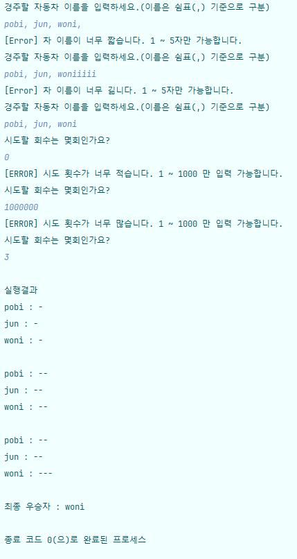

# 🚗 java-racingCar-precourse

### 📑 <기능 요구 사항>
##### 1. 초간단 자동차 경주 게임을 구현한다.
##### 2. 주어진 횟수 동안 n대의 자동차는 전진 또는 멈출 수 있다.
##### 3. 각 자동차에 이름을 부여할 수 있다. 전진하는 자동차를 출력할 때 자동차 이름을 같이 출력한다.
##### 4. 자동차 이름은 쉼표(,)를 기준으로 구분하며 이름은 5자 이하만 가능하다.
##### 5. 사용자는 몇 번의 이동을 할 것인지를 입력할 수 있어야 한다.
##### 6. 전진하는 조건은 0에서 9 사이에서 무작위 값을 구한 후 무작위 값이 4 이상일 경우이다.
##### 7. 자동차 경주 게임을 완료한 후 누가 우승했는지를 알려준다. 우승자는 한 명 이상일 수 있다.
##### 8. 우승자가 여러 명일 경우 쉼표(,)를 이용하여 구분한다.
##### 9. 사용자가 잘못된 값을 입력할 경우 IllegalArgumentException를 발생시키고, "[ERROR]"로 시작하는 에러 메시지를 출력 후 그 부분부터 입력을 다시 받는다.
##### 10. Exception이 아닌 IllegalArgumentException, IllegalStateException 등과 같은 명확한 유형을 처리한다.

### 💡 <대강적인 로직 및 구현 방식>
- MVC 패턴을 적용함
  - Model : RacingCarModel 클래스 -> 차 이름을 Key, 위치를 Value로 하는 Map과 이동 횟수를 저장한다.
  - View : UI 클래스 -> 유저로부터의 입력, 유저에게로의 출력을 담당한다.
  - Controller : RacingCarController, RacingCarUtil 클래스 -> Model과 View를 흐름에 따라서 관리한다.
- 클래스의 분리
    - 처음에는 RacingCarController 클래스의 책임이 너무 무거워서 RacingCarutil 클래스로 책임을 분리해줬지만 
    - 나중가서 RacingCarUtil 클래스도 너무 많은 책임을 가지고 있어서 비즈니스 로직은 RacingCarService로 분리했다.
- 예외처리
  - while true loop를 이용하여 IllegalArgumentException이 안뜰 때 까지 유저의 input을 받는 방식을 사용했다.
  - 그 밖에 개발자가 예상치 못한 예외는 프로그램을 종료하도록 구현했다.
  - 시도 횟수를 0이하 일때와 1000보다 더 많이 입력할 때에도 예외를 던지도록 구현했다.

### 💻 <실행 결과>
