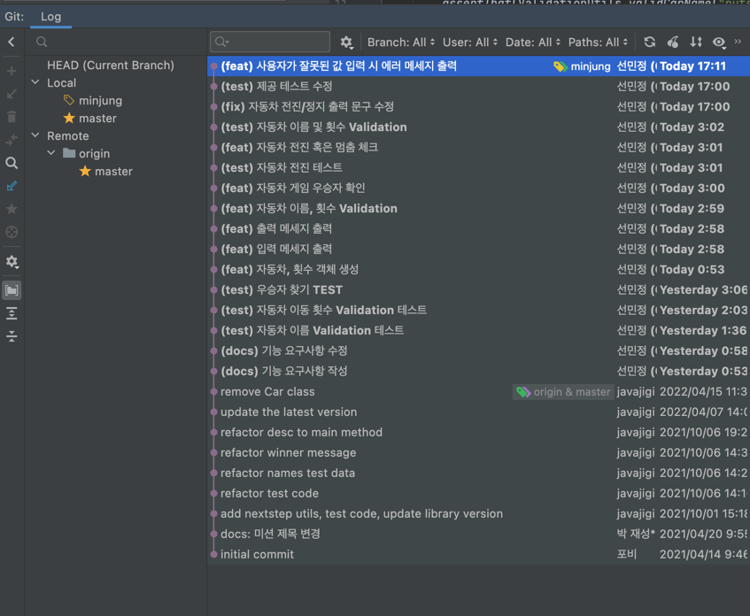

# 자동차 경주 게임
## 기능 요구사항

### 입력
- 자동차의 이름을 입력한다.
  - (요구) 이름은 쉼표(,)로 구분한다.
  - (요구) 이름은 5자 이하만 가능하다.
  - (제약) 각 자동차의 이름은 White-Space 포함하여 최대 5자
  - (제약) 각 자동차의 이름은 White-Space 제외하여 최소 1자
- 자동차의 이동 횟수를 입력한다.
  - (제약) 0이 아닌 숫자만 입력한다.
  - (제약) 양수 값을 입력한다.
- 잘못된 값 입력 시, 다음과 같이 처리한다.
  - IllegalArgumentException 처리한다.
  - "[ERROR]"로 시작하는 에러메세지 출력한다. (예)[ERROR] 시도 횟수는 숫자여야 한다.
  - 재 입력받는다.

### 동작
- 자동차는 다음과 같이 움직인다.
  - 멈춤: Random 값이 3이하(0,1,2,3) 범위의 값인 경우
  - 전진: Random 값이 4이상(4,5,,7,8,9) 범위의 값인 경우
- 이동 횟수만큼 진행 후, 어떤 자동차가 가장 많이 전진했는지 체크한다.

### 출력
- 각 자동차의 이동값을 자동차 이름과 대시(-)로 출력한다.
  - 대시(-)는 0부터 9사이의 Random한 값만큼 출력한다.
- 우승자를 안내한다.
  - 우승자가 1명 이상일 경우 쉼표(,)로 이름을 구분해 출력한다.

### 참고
미션 완료 후, fork 작업을 누락했음을 확인했습니다.
Pull Request 하여 올린 소스의 commit 메세지가 Live하지 않아, 작업했던 소스의 Live Commit 메세지를 첨부합니다.
